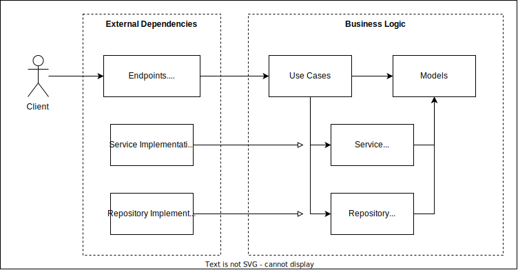

# backend

[ Русский язык](./README_ru.md)

## Project's structure

This project follows the principles of pure architecture.
The business logic does not depend on web frameworks, databases
or any other technologies directly.

Considering the many file structures in the project,
I settled on a simplified option that Robert Smallshire suggested in
[his talk on DDD implementation][ProjectStructureLink]
at the europython conference.

We have 3 main modules that have strictly separated areas of responsibility:

| Module's name    | Area of responsibility   |
|------------------|--------------------------|
| `domain`         | Domain-logic             |
| `infrastructure` | Services implementation  |
| `application`    | Application endpoints    |

## Fighting external dependencies in the business logic layer

Business logic scenarios depend on the interfaces of different services,
which allows different implementations of these services to be specified
for different entry points.

Thus, the prod will use the StorageS3 implementation of the IStorage interface,
while unit testing will use StorageMock. Thanks to the DI library punq, which
makes it very easy to inject dependencies.

You can take a look at DI container creationg at
[application/common/container.py](./application/common/container.py)
and using it in
[application/web/upload_file/api.py](./application/web/upload_file/api.py) file.

[ProjectStructureLink]: https://youtu.be/Ru2T4fu3bGQ?t=2878
