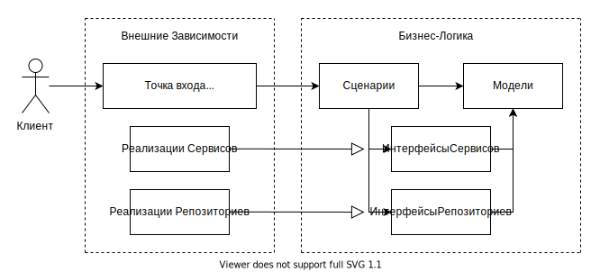

# backend

## Структура проекта

Данный проект следует принципам чистой архитектуры. Бизнес-логика не зависит
от веб-фреймворков, баз данных и любых других технологий напрямую.



Рассматривая множество структур файлов в проекте, я остановился на упрощённом
до чистой архитектуры варианте, который предложил Robert Smallshire в своём
[докладе][ProjectStructureLink] о реализации DDD на конференции europython.

У нас есть 3 основных модуля, у которых
строжайшим образом разделены зоны ответственности:

| Название модуля  | Зона ответственности     |
|------------------|--------------------------|
| `domain`         | Бизнес-логика            |
| `infrastructure` | Имплементации сервисов   |
| `application`    | Точки входа в приложение |

## Борьба с внешними зависимостями в слое бизнес-логики

Сценарии бизнес-логики зависят от интерфейсов различных сервисов, что позволяет
для различных точек входа указывать разные реализации этих сервисов.

Так, на проде будет использоваться StorageS3 реализация интерфейса IStorage,
тогда как при unit-тестировании - StorageMock. Спасибо DI библиотеке punq,
которая позволяет очень просто внедрять зависимости.

Вы можете взглянуть на создание DI контейнера
[common/container.py](./common/container.py) и его использование в файле
[application/web/upload_file/api.py](./application/web/upload_file/api.py).

## Интересные решения, которые я хотел бы отметить

### Динамическая подгрузка сценариев в DI контейнер

Решил вернуть творчество в свою работу, снова использовав библиотеку importlib.

Всё в том же файле [common/container.py](./common/container.py) есть функция
`_load_use_cases`, которая вызывается на этапе инициализации DI контейнера.

```python
import importlib
import inspect
from typing import Any

from common.base import BaseUseCase
from libs import punq

from .config import Config

...

def _load_use_cases(container: punq.Container) -> None:
    """Загрузка всех сценариев из приложений."""
    loaded_use_cases: set[str] = set()

    # Пробегаемся по всем приложениям
    apps = container.resolve(Config).app.apps
    for app in apps:
        try:
            # Пытаемся импортировать модуль сценариев из приложения
            use_cases_module = importlib.import_module(f"domain.{app}.use_cases")
        except ModuleNotFoundError:
            continue

        # Пробегаемся по всем классам из модуля сценариев
        module_members: list[tuple[str, Any]] = inspect.getmembers(use_cases_module)
        for member_name, member in module_members:
            member_mro = getattr(member, "mro", None)
            if member_mro is None:
                continue

            # В DI контейнер регистрируем только те классы,
            # которые унаследованы от `BaseUseCase`
            mro = member_mro()
            if len(mro) > 2 and BaseUseCase in mro:
                if member_name in loaded_use_cases:
                    continue

                loaded_use_cases.add(member_name)
                container.register(member)
```

Благодаря ей, если нужно будет написать новый сценарий, не нужно будет ручками
регистрировать его в контейнере.

[ProjectStructureLink]: https://youtu.be/Ru2T4fu3bGQ?t=2878
