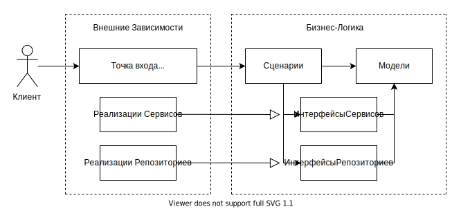

# backend

[ English Language](./README.md)

## Структура проекта

Данный проект следует принципам чистой архитектуры. Бизнес-логика не зависит
от веб-фреймворков, баз данных и любых других технологий напрямую.

Рассматривая множество структур файлов в проекте, я остановился на упрощённом
до чистой архитектуры варианте, который предложил Robert Smallshire в своём
[докладе][ProjectStructureLink] о реализации DDD на конференции europython.

У нас есть 3 основных модуля, у которых
строжайшим образом разделены зоны ответственности:

| Название модуля  | Зона ответственности     |
|------------------|--------------------------|
| `domain`         | Бизнес-логика            |
| `infrastructure` | Имплементации сервисов   |
| `application`    | Точки входа в приложение |

## Борьба с внешними зависимостями в слое бизнес-логики

Сценарии бизнес-логики зависят от интерфейсов различных сервисов, что позволяет
для различных точек входа указывать разные реализации этих сервисов.

Так, на проде будет использоваться StorageS3 реализация интерфейса IStorage,
тогда как при unit-тестировании - StorageMock. Спасибо DI библиотеке punq,
которая позволяет очень просто внедрять зависимости.

Вы можете взглянуть на создание DI контейнера
[application/common/container.py](./application/common/container.py)
и его использование в файле
[application/web/upload_file/api.py](./application/web/upload_file/api.py).

[ProjectStructureLink]: https://youtu.be/Ru2T4fu3bGQ?t=2878
